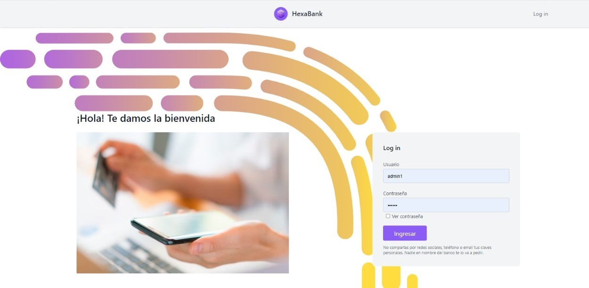

# HexaBank

**HexaBank** es un proyecto desarrollado en el marco de la materia **Laboratorio de Computación 4** de la [Tecnicatura Universitaria en programación (UTN)](https://www.frgp.utn.edu.ar/carreras/tup_tuss). Desarrollado por Guada Juricich, [Alejandro Morales](https://github.com/AlejandroDanielMorales), [Alex Welz](https://github.com/alexwelz), Teo y Dante Beltrán. 


## Tecnologías Utilizadas

- **Lenguaje**: JAVA - SQL.
- **Plataforma Web**: Servlets y JSP con Apache Tomcat.
- **Estilos**: Tailwind CSS.
- **Entorno de Desarrollo**: Eclipse IDE - MySQL.

## Arquitectura del Proyecto:

El proyecto presenta una arquitectura en capas y se despliega mediante el servidor **Apache Tomcat** :
- **Dao**: Gestión de acceso a datos (Data Access Object).
- **Entidad**: Entidades de datos.
- **Negocio**: Lógica de negocio de la aplicación.
- **Servlets**: Servlets para manejar las solicitudes HTTP.
- **Vistas JSPs**: JSPs relacionados con la interfaz web.

## ¿Cómo utilizar HexaBank?



Para ejecutar este proyecto es necesario tener instalado lo siguiente:
   - **Java JDK 12** o superior.
   - **Eclipse IDE**.
   - **Apache Tomcat 8.5**  o superior.
   - **MySQL**.

#### Configuración del Entorno

1. **Clona el repositorio** :
   ```bash
   git clone https://github.com/Gjuricich/hexa-bank.git
   
2. Importa el proyecto. Abre Eclipse y selecciona File > Import > Existing Projects into Workspace.

3. Configura Apache Tomcat asociando el proyecto al servidor.

4. Ejecuta el script de la base de datos y actualiza el archivo de configuración de la base de datos (conexión) con tus credenciales de MySQL.
  
5. Compila y ejecuta el proyecto. En Eclipse, selecciona Run > Run on Server para desplegar el proyecto en el servidor Apache Tomcat.


## Documentación

El diseño y desarrollo de Nonox se encuentra detallado en este [informe](https://drive.google.com/file/d/1rcuyR0Kk74rbur8ye6AZdhAs2pEmCW5f/view?usp=sharing) donde podrá acceder:

1. DER.
2. Funcionalidad Login.
3. Funcionalidad Administrador.
4. Funcionalidad Cliente.
   
## Licencia 
Code copyright 2024 
